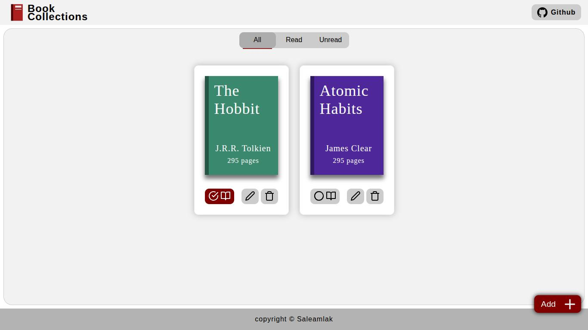
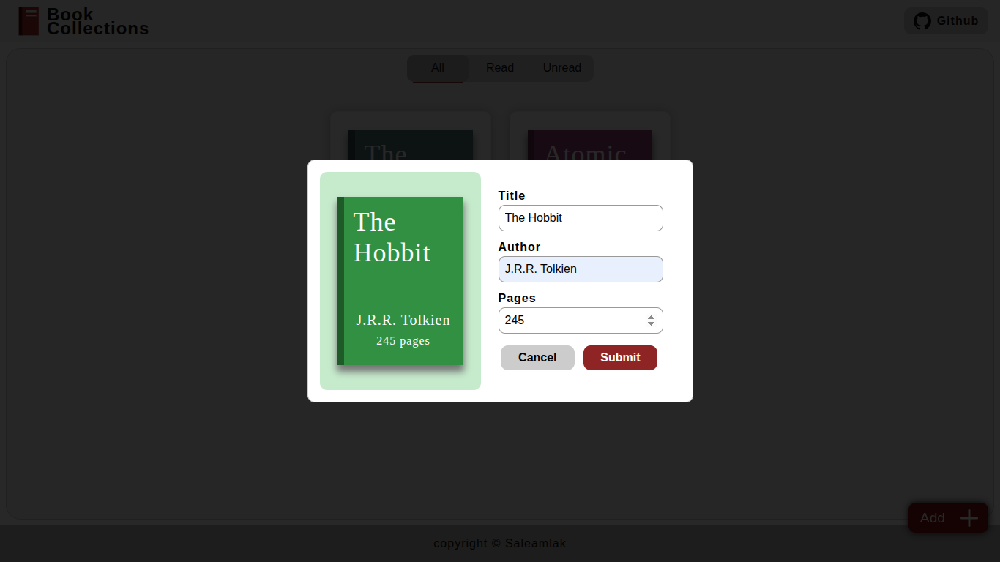

# Library

This project is part of **Javascript Course** on [The Odin Project](https://www.theodinproject.com).

This project includes features like changing read status, editing, deleting, filtering books, live preview with randomly colored book cover for adding and editing. 

This project improved my understanding of semantic HTML elements, event listeners, the return value of `<dialog>` (even though I ended up using FormData() to read input values) object binding (this), and object relationships. I also spent time working with SVGs, such as creating the logo and improving the read-status check mark icon.

[**Live Demo**](https://saleamlakh.github.io/library)

